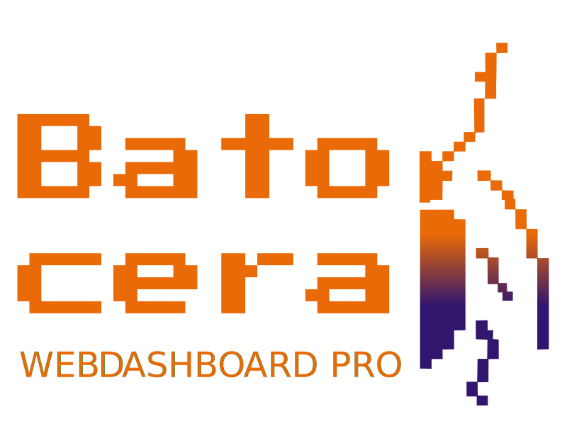
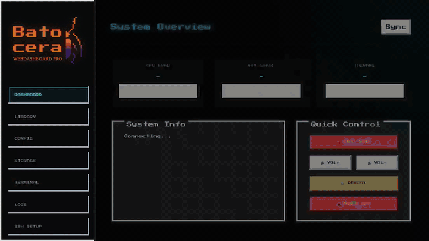
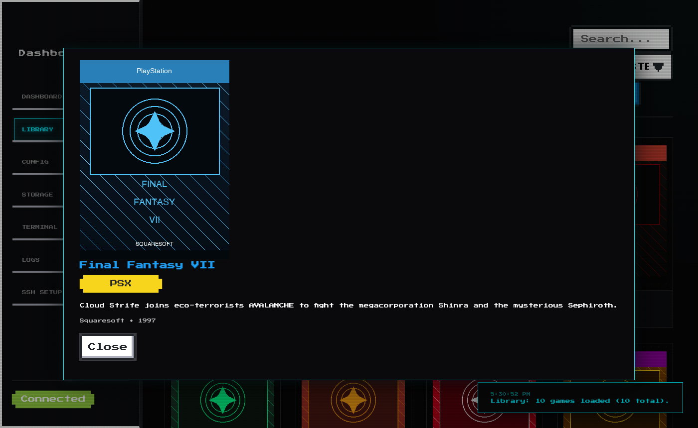
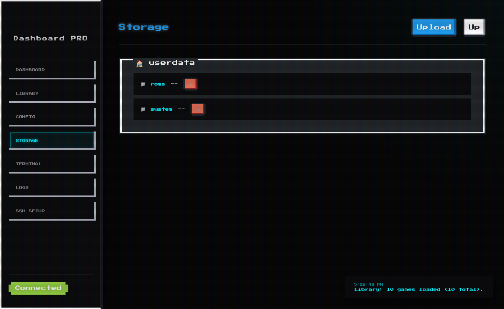
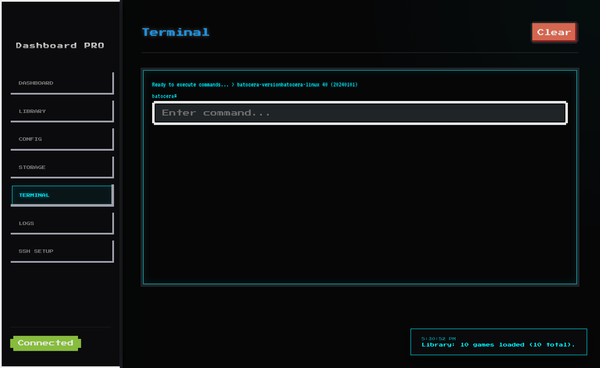
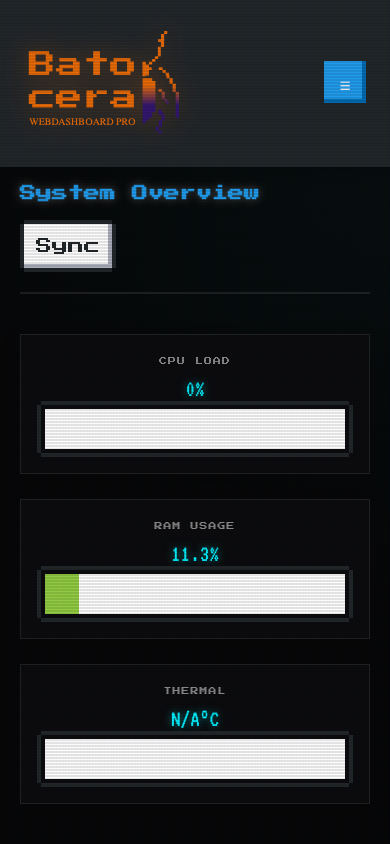

<p align="center">
  
</p>

<p align="center">
  A retro-styled web control center for your <a href="https://batocera.org">Batocera Linux</a> gaming system.
  <br>Manage ROMs, monitor stats, browse files — all from any browser on your network.
</p>

<p align="center">
  <a href="https://github.com/DavidSchuchert/Batocera-WebDashboard-Pro/actions/workflows/ci.yml">
    
  </a>
  
  
  
  
</p>

---

## What is this?

Batocera Web Dashboard PRO is a browser-based control panel you can run **alongside** your Batocera setup. It gives you a live view of your system, a ROM library browser with cover art, a file manager, a terminal, and emulator configuration — all without touching a keyboard on the console.

**Two deployment modes:**

| Mode | Where it runs | Best for |
|------|--------------|----------|
| 🌐 **Remote** | Your Mac/PC/server via SSH | Managing Batocera from another machine |
| 🌐 **Remote (Docker)** | Docker container on Mac/PC/server | Same as Remote, but no Python needed |
| 🎮 **Native** | Directly on Batocera | Always-on, auto-starts with the console |

---

## Features

- **📊 Live Stats** — CPU, RAM, and temperature updated every 2 seconds via Server-Sent Events
- **🎮 ROM Library** — Browse up to 5,000 games with cover art, developer info, and descriptions from `gamelist.xml`
- **🔍 Instant Search** — Debounced search with multi-word filtering across all systems
- **⚙️ Emulator Config** — Edit `batocera.conf` settings (shaders, emulators, video modes) in the browser
- **📁 File Manager** — Navigate `/userdata`, upload ROMs, download saves, delete files
- **🖥️ Terminal** — Shell access with dangerous command blocking
- **📜 Logs** — Live view of EmulationStation, boot, and syslog
- **📱 Mobile-ready** — Responsive layout, works on phone/tablet
- **🔒 Security** — Path traversal protection, command allowlist, input sanitisation

---

## Demo

<p align="center">
  
</p>

## Screenshots

<p align="center">
  
  &nbsp;
  
</p>
<p align="center">
  
  &nbsp;
  
</p>
<p align="center">
  
  &nbsp;
  
</p>

> **Note on cover art:** The screenshots use placeholder covers generated from game metadata. For privacy and copyright reasons, no actual game artwork is included in this repository. On a real Batocera system, Scraper automatically downloads official cover art from sources like ScreenScraper or TheGamesDB into your `/userdata/roms/*/images/` folders.

---

## Installation

### One-line setup (all platforms)

```bash
git clone https://github.com/DavidSchuchert/Batocera-WebDashboard-Pro.git
cd Batocera-WebDashboard-Pro
chmod +x install.sh && ./install.sh
```

The installer **auto-detects your OS** (Batocera, macOS, Linux, WSL, Git Bash) and walks you through Remote vs Native setup interactively.

> 💡 **Both modes can be installed from your Mac/PC.**
> If you pick **Native** while running on macOS/Linux, the installer
> will ask for your Batocera's SSH details and **push the install to
> the device** — you don't need to copy files manually or run anything
> on Batocera itself. (Make sure SSH is enabled in
> Batocera → Network Settings.)

**Windows:** double-click `install.bat` — it finds WSL or Git Bash automatically.

### Installer commands

```bash
./install.sh                # Interactive setup (guided)
./install.sh --update       # Update to latest version (config preserved)
./install.sh --status       # Show mode, version, port, process
./install.sh --uninstall    # Clean removal
./install.sh --unattended   # Non-interactive via ENV vars
```

### Unattended / headless

```bash
export BATOCERA_MODE=remote
export BATOCERA_HOST=192.168.1.100
export BATOCERA_USER=root
export BATOCERA_PASS=linux
export PORT=8989
./install.sh --unattended
```

### After install
| Mode | URL |
|------|-----|
| Remote | `http://localhost:8989` |
| Remote (Docker) | `http://localhost:8080` |
| Native | `http://batocera.local:8989` |

### Docker setup (Remote only)

Docker runs the Remote mode in a container — no Python or dependency installation needed on your machine.

```bash
# 1. Clone & enter
git clone https://github.com/DavidSchuchert/Batocera-WebDashboard-Pro.git
cd Batocera-WebDashboard-Pro

# 2. Create config
cp docker/.env.example docker/.env
# Edit docker/.env and set BATOCERA_HOST, BATOCERA_USER, BATOCERA_PASS

# 3. Start
docker compose -f docker/docker-compose.yml up -d

# → http://localhost:8080
```

Or use the installer: `./install.sh` → choose option [3] 🐳 Docker.

**Docker commands:**
```bash
docker compose -f docker/docker-compose.yml up -d      # start
docker compose -f docker/docker-compose.yml down        # stop
docker logs batocera-dashboard                         # view logs
docker exec -it batocera-dashboard /bin/bash           # shell inside
```

---

## Testing

The project has a full test suite: 82 API tests + 22 Playwright E2E browser tests.

```bash
# Start test environment
docker compose -f docker-compose.test.yml up --build -d

# Run API tests (no extra deps needed)
python3 tests/run_tests.py

# Run browser tests (requires Node.js)
cd tests/e2e && npm install && npx playwright install chromium
npx playwright test

# Everything in one go
python3 tests/run_tests.py --start-stack --stop-after
```

See [TESTING.md](TESTING.md) for the full testing guide.

---

## Security

This tool is designed for **local home networks**. It provides root-level access to your Batocera machine. Do **not** expose the port to the public internet.

Built-in protections:
- All file endpoints restricted to `/userdata` (path traversal blocked with 403)
- Terminal blocks destructive commands (`rm -rf /`, `mkfs`, `dd if=`, fork bombs, etc.)
- Input sanitisation against XSS in the file browser
- Upload filenames stripped of directory components

---

## Contributing

Pull requests are welcome! If you find a bug or want to add a feature:

1. Fork the repo and create a feature branch
2. Make your change
3. Run `python3 tests/run_tests.py --start-stack --stop-after` to verify nothing broke
4. Open a PR against `main`

For major changes, open an issue first to discuss the approach.

---

## License

MIT — see [LICENSE](LICENSE) for details.

---

<p align="center">
  Made for the <a href="https://batocera.org">Batocera</a> community by <strong>DavidSchuchert</strong> ❤️
  <br>
  <a href="https://github.com/DavidSchuchert/Batocera-WebDashboard-Pro/issues">Report a bug</a> ·
  <a href="https://github.com/DavidSchuchert/Batocera-WebDashboard-Pro/discussions">Discuss</a> ·
  <a href="https://forum.batocera.org">Batocera Forum</a>
</p>
