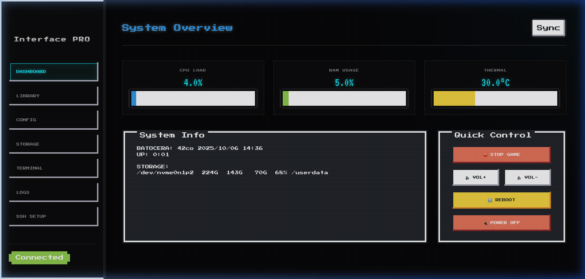

# 🕹️ Batocera Web Dashboard PRO

<p align="center">
  
</p>


**Batocera Web Dashboard PRO** is a professional, retro-inspired web control center for your Batocera Linux system. It allows you to manage ROMs, configure emulators, and monitor system performance with a high-end "Cyber-Noir" aesthetic.

---

## ⚡ Choose Your Version

There are two ways to deploy this interface. Choose the one that fits your workflow:

### 🏠 1. Remote Version (Standard)
**Best for:** Users who want to manage their Batocera from a powerful PC or laptop while the console is running.
- **How it works:** Runs on your Windows/Mac/Linux PC and connects to Batocera via SSH.
- **Pros:** No installation needed on the Batocera device itself; uses your PC's resources.
- **Setup:** Run `./start.sh` on your PC and enter your Batocera IP.

### 🕹️ 2. Native Version (Standalone)
**Best for:** Users who want the interface to be a permanent part of their Batocera console.
- **How it works:** Runs directly on the Batocera hardware. Starts automatically when you turn on the console.
- **Pros:** Always available, zero latency, standalone (no second PC needed).
- **Setup:** Copy the `batocera-native` folder to your device and run the installer.
- **Documentation:** [See Native Installation Guide](batocera-native/README.md)

---

## ✨ Features

- **🚀 Premium Dashboard**: Real-time stats for CPU, RAM, and Temperature.
- **📚 Library Manager**: Full metadata support (Developer, Description) and search for up to 5000 games.
- **⚙️ System Config**: Edit `batocera.conf` settings (Cemu, PCSX2, etc.) directly in the browser.
- **📁 Storage Explorer**: Manage BIOS, ROMs, and saves with a built-in file explorer.
- **🖥️ Remote Terminal**: Direct shell access to your Batocera.
- **📜 Live Logs**: View EmulationStation and system logs in real-time.

---

## 🚀 Installation (Remote Version)

1. **Clone the Repo:**
   ```bash
   git clone https://github.com/DavidSchuchert/Batocera-WebDashboard-Pro.git
   cd Batocera-WebDashboard-Pro
   ```
2. **Run:**
   ```bash
   chmod +x start.sh
   ./start.sh
   ```
3. **Access:** Open `http://localhost:8989`

---

## 🖼️ Screenshots

<p align="center">
  
  
</p>

---

## 🔒 Security
This tool is intended for use within your **local home network**. Do not expose the port to the public internet, as it allows root-level access to your Batocera system.

## 📜 License
MIT License. See [LICENSE](LICENSE) for details.

---

*Created for the Batocera community by **DavidSchuchert** with ❤️.*
 
